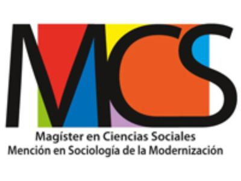
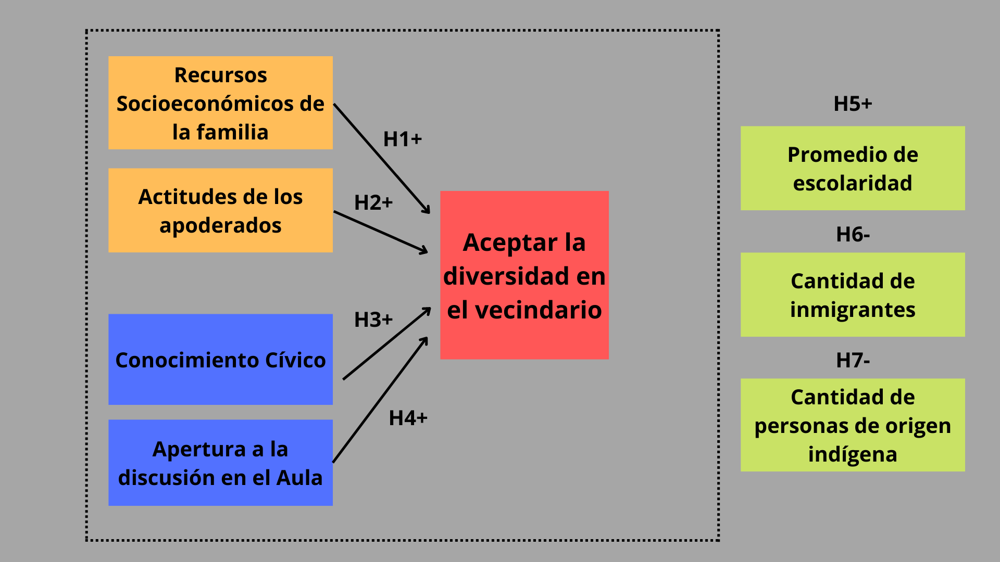
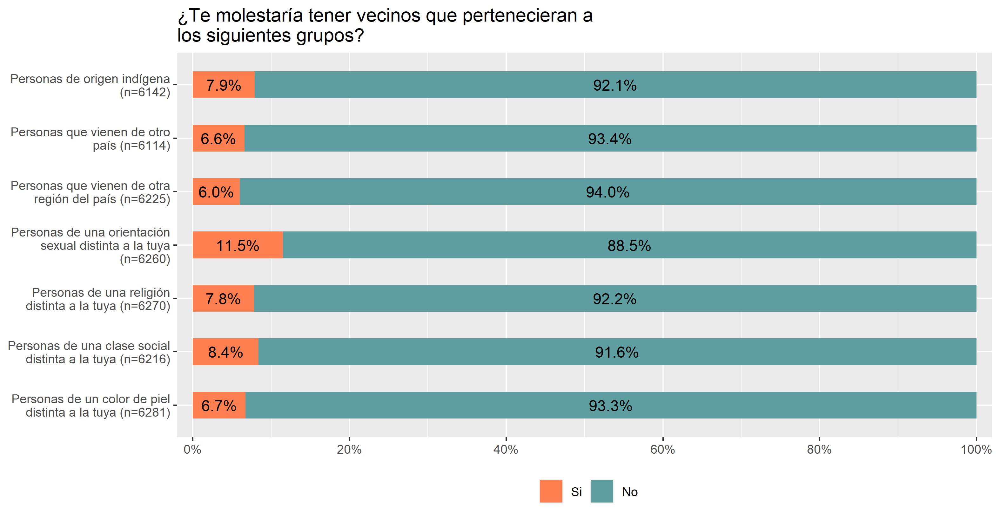
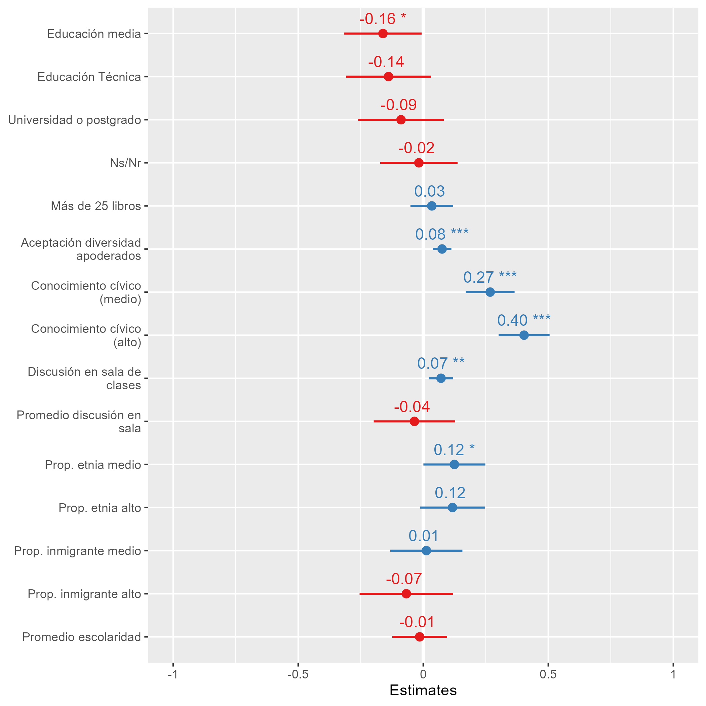
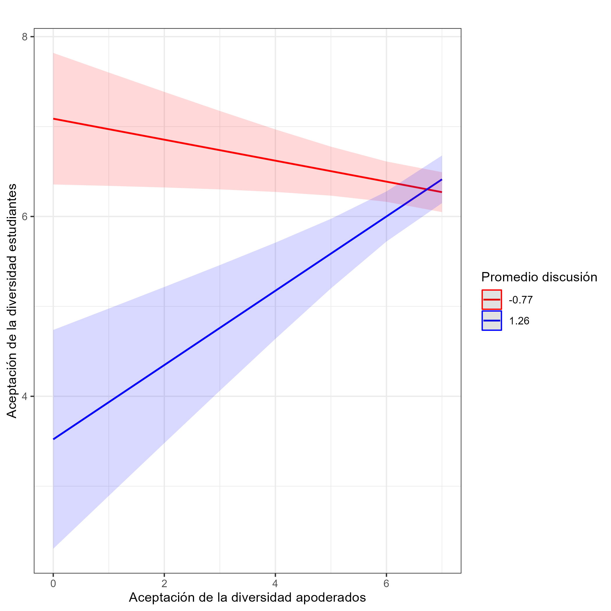

class: middle title-slide

```{r xaringanExtra, echo = FALSE}
  xaringanExtra::use_progress_bar(color = "red", location = c("top"))
```

.pull-left[




]


.pull-right[
.content-box-purple[
## Aceptar la diversidad en el vecindario
----
#### Procesos de Socialización política de actitudes hacia la diversidad social en jóvenes estudiantes chilenos

]

.red[
.center[

### Kevin Carrasco Quintanilla
 

Conferencia COES - 11 de Noviembre 2022
]]

]
---

layout: true
class: animated, fadeIn

---
class: middle inverse

## Aceptar la diversidad en el vecindario

* Educación ciudadana y Políticas educativas

* Procesos de socialización política de actitudes

* Metodología e hipótesis

* Resultados

* Discusión

---

## Contexto

--

### Educación ciudadana y Políticas educativas

* Educación ciudadana en Chile

* Nueva ley de Formación Ciudadana 2018

--

### Esta investigación

* El incremento de la diversidad social es un desafío para los Estados-nación a nivel global

* Desafío específico para los sistemas educacionales

* Aceptar la diversidad en el vecindario.

---

### Aceptar la diversidad en el vecindario

* Identidades y Cohesión social: la identidad social define y evalúa el autoconcepto de uno mismo y cómo será tratado y pensado por los demás. Al compararse, se preocupan de que su propio grupo sea distintivo, diferenciado y evaluado más favorablemente.

--

* Desigualdades interaccionales: Se constituye al *otro* como una amenaza y adversario, quebrando la noción de espacio común y generando un marco de confrontación y disputa.

--

* Cierre social entre sectores o clases a partir de identidades: Se establecen barreras entre sectores o clases a partir de la construcción de identidades, comunidades y la monopolización de oportunidades con el fin de excluir a otras personas de ese círculo.

--

La **discriminación** como una práctica diferenciada basada en prejuicios e ideologías racistas sobre la superioridad de una mayoría y la inferioridad de una minoría. No obstante, reducir o intensificar ciertas actitudes tendrá poco efecto los prejuicios e ideologías, por lo que **el foco debe estar en los mecanismos sociales que los generan**.

---

### Procesos de socialización política de actitudes

--

#### Socialización política familiar

* Condiciones socioeconómicas objetivas de la familia en el proceso de adquisición de valores y prácticas democráticas.

* Teoría del aprendizaje social y transmisión intergeneracional de actitudes.

--

#### Socialización política en la escuela

* Conocimiento cívico y funcionamiento de la sociedad: socialización de valores y normas comunes

* Espacios de discusión y debate en las salas de clase: exposición al mundo real de los problemas sociales y políticos

--

#### Implicancias del vecindario en los procesos de socialización

* Segregación urbana en el contexto chileno

* Competencia en el mercado laboral y en el acceso a recursos culturales y sociales


---
## Hipótesis
.center[]

---
## Metodología

.pull-left[
.center[]
]


.pull-right[
Primer Estudio de Formación Ciudadana de 2017

Realizado por la Agencia de Calidad de la Educación

Estudiantes y apoderados

]

.center[Preregistro de hipótesis: https://doi.org/10.17605/OSF.IO/URPZQ]

---

### Variable dependiente

.center[]

---

### Variable dependiente

.center[]

---
### Variables independientes

.pull-left[
.content-box-red[
.espaciosimplelineas[
### Familia

Nivel educacional de los padres

Cantidad de libros en el hogar

Actitudes de los apoderados
]
]
]
.pull-right[
.content-box-green[
### Escuela

Conocimiento cívico

Espacios de discusión en la sala de clases
<br>
<br>

]
]

.center[
.content-box-yellow[
.espaciosimplelineas[
### Territorio
Proporción de personas que se identifican con alguna etnia

Proporción de personas de origen migrante

Promedio de escolaridad
]
]
]

---

.pull-left[
<br>
<br>
<br>
<br>
<br>
<br>
## Resultados
]
.pull-right[
<br>
<br>
.center[]
]

---
.pull-left[
<br>
<br>
<br>
<br>
<br>
<br>
## Resultados
]
.pull-right[
<br>
<br>
.center[]
]
---

# Discusión

En general, la transmisión intergeneracional de actitudes es lo que prima dentro de la familia. **Las actitudes de los padres son las influyen en las actitudes de los estudiantes**. No se observan diferencias según condiciones socioeconómicas de la familia

Dentro de **la escuela**, el conocimiento cívico de los estudiantes y los espacios de discusión dentro de las aulas **influyen positivamente en la construcción de ciudadanos más tolerantes**. Además, **los espacios de discusión influyen en la transmisión intergeneracional**.

Por lo tanto, se plantea como esencial para las escuelas y el sistema educativo en su conjunto **fomentar los espacios de discusión, el pluralismo de ideas y la convivencia**, para así garantizar para todos/as los estudiantes -ciudadanos futuros- la presencia de actitudes tolerantes hacia los grupos sociales que son distintos a sí mismos.

---
class: inverse

# Muchas gracias!