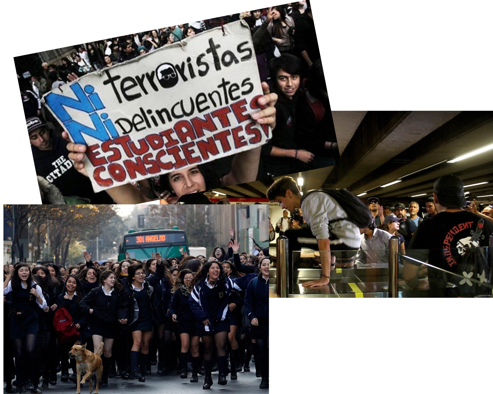
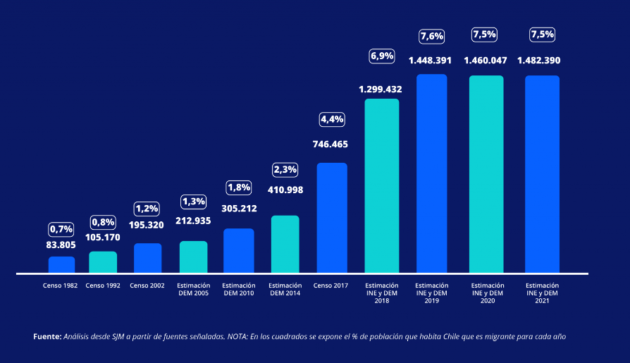
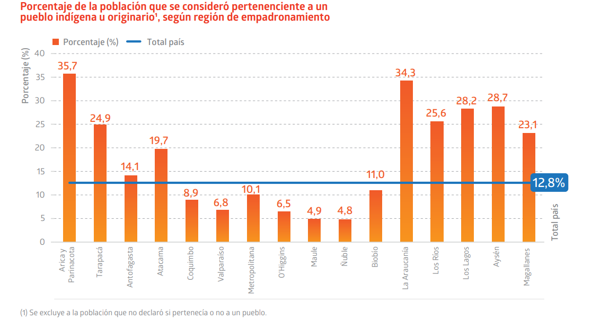
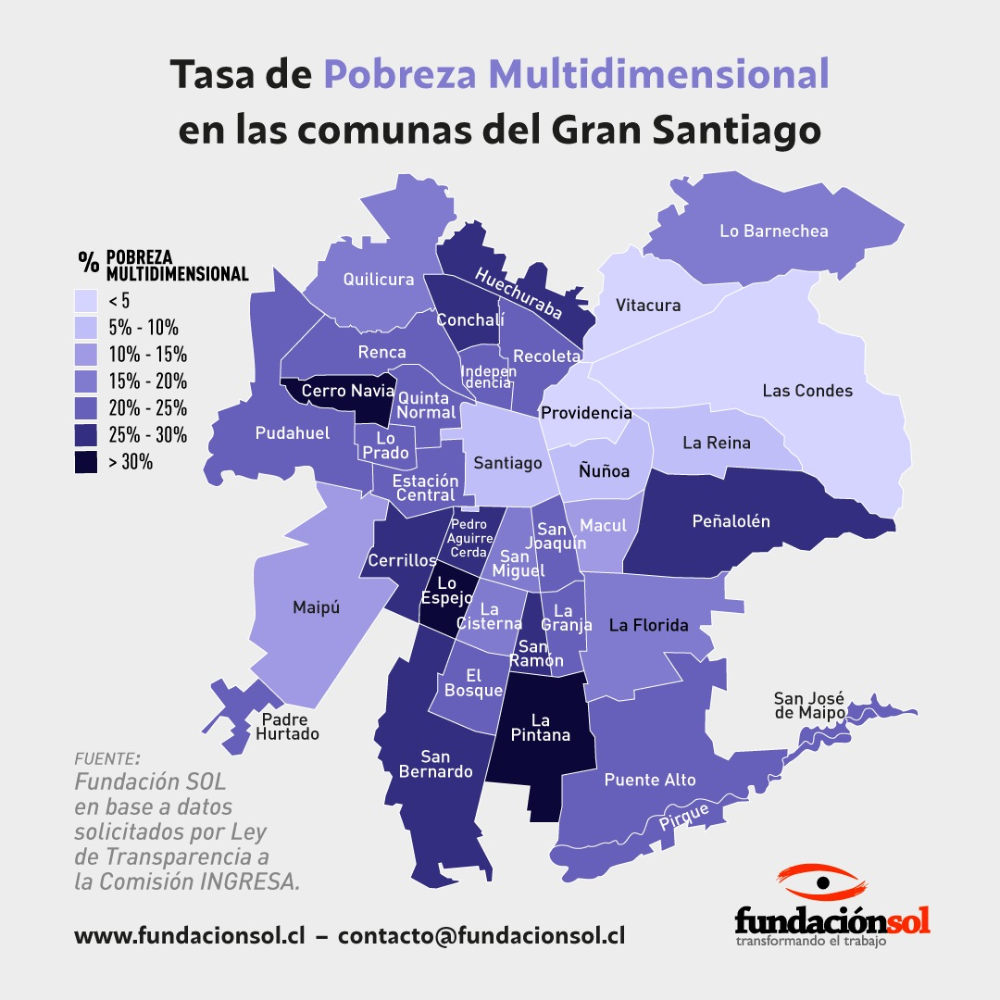
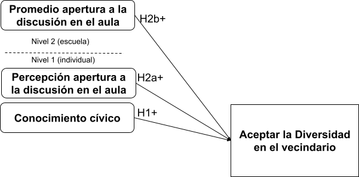
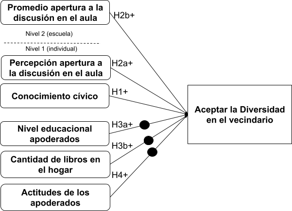
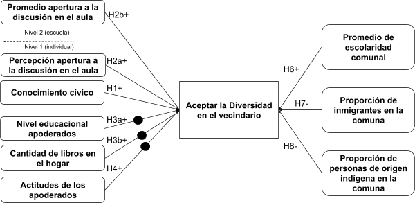
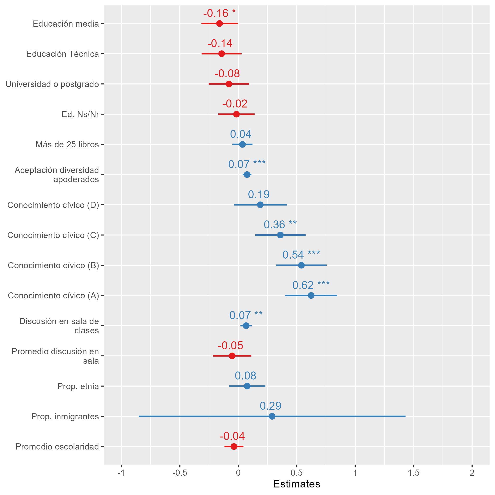
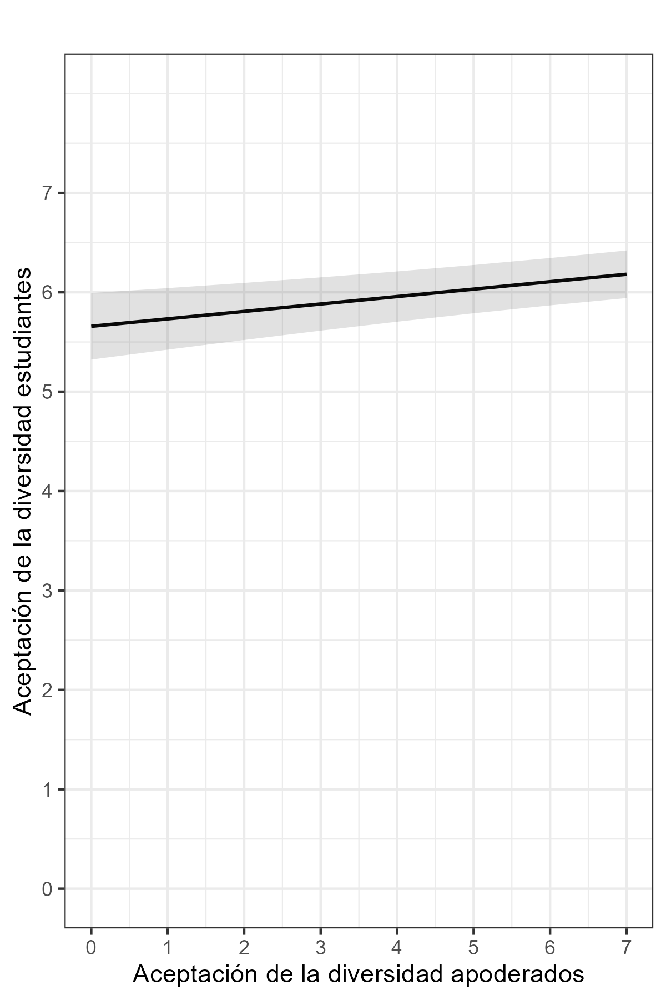
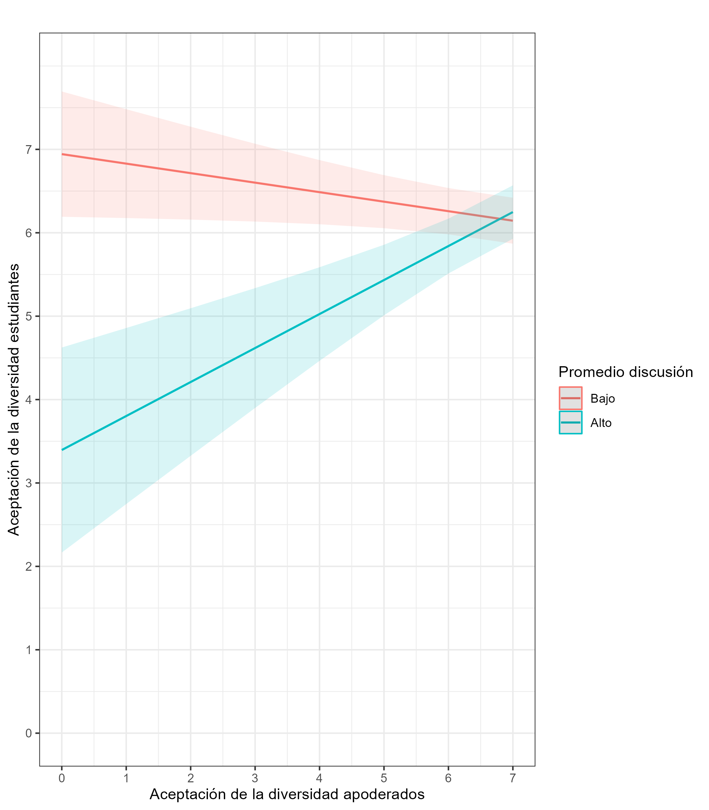

class: middle title-slide

```{r xaringanExtra, echo = FALSE}
  xaringanExtra::use_progress_bar(color = "red", location = c("top"))
```

.pull-left[


.center[


]
]


.pull-right[

.content-box-purple[
.center[

## Aceptar la diversidad en el vecindario
]

----
.center[
#### Procesos de Socialización política de actitudes hacia la diversidad social en estudiantes chilenos
]
]
]

.center[

### Kevin Carrasco Quintanilla

Examen para optar al título de Sociólogo y Magíster en Ciencias Sociales

Profesor guía: Juan Carlos Castillo

Profesores informantes: Nicolás Angelcos & 
Pablo Pérez
.red[ 30 de Marzo 2023
]

]
---

layout: true
class: animated, fadeIn

---
## Contexto

--


.pull-left[

* Participación política en Chile

* Cuestionamiento a la democracia e instituciones políticas

* Baja participación política juvenil
]
--


.pull-right[

]

---
## Contexto


.pull-left[

* Más allá de la formación cívica: **Actitudes, integración, cohesión social**

* Nueva ley de formación ciudadana

* Socialización política escolar

* Socialización política familiar

]
.pull-right[

]

---

### Esta investigación

* Incremento de la diversidad en Chile: **Migrantes**

.center[

]

---
### Esta investigación

* Incremento de la diversidad en Chile: **Etnias**

.center[

]
fuente: [síntesis de resultados censo 2017](http://www.censo2017.cl/descargas/home/sintesis-de-resultados-censo2017.pdf)
---
### Esta investigación

* Incremento de la diversidad en Chile: **clase**

.center[

]

---

class: inverse, center, middle

## .yellow[¿En qué medida los distintos procesos de socialización son capaces de influir en las actitudes hacia la diversidad de las y los estudiantes chilenos?
]

---

class: inverse, left, middle

### Aceptar la diversidad en el vecindario. Procesos de Socialización política de actitudes hacia la diversidad social en estudiantes chilenos

1. Aceptación de la diversidad

2. Socialización de la aceptación de la diversidad

  a. Socialización política escolar
  
  b. Socialización política familiar
  
  c. Implicancias del territorio
  
3. Metodología

4. Resultados

5. Conclusiones

---

class: inverse, left, middle

### Aceptar la diversidad en el vecindario. Procesos de Socialización política de actitudes hacia la diversidad social en estudiantes chilenos

1. **Aceptación de la diversidad**

2. Socialización de la aceptación de la diversidad

  a. Socialización política escolar
  
  b. Socialización política familiar
  
  c. Implicancias del territorio
  
3. Metodología

4. Resultados

5. Conclusiones

---

## Aceptación de la diversidad

* Exclusión, discriminación y prejuicios

  *"Se establecen barreras entre sectores o clases a partir de la construcción de identidades, comunidades y la monopolización de oportunidades con el fin de excluir a otras personas de ese círculo."* (Parkin, 1984)
  
  *"se constituye al otro como una amenaza y adversario, quebrando la noción de un espacio común y dando un marco de confrontación y disputa a las relaciones ordinarias entre los habitantes de la ciudad."* (Araujo, 2019)


--

* ¿Por qué **aceptar la diversidad**?

    *"Aprender a aceptar y valorar la creciente diversidad social que se origina a partir de los procesos de modernización y globalización permite ayudar a las personas a desarrollar habilidades para la vida en sociedad, como la empatía y la tolerancia. De esta forma se promueve una sociedad más inclusiva, respetuosa y equitativa, donde se acepte a las personas por quienes son, independientemente de sus diferencias culturales, étnicas, religiosas o de clase".*

---

## Aceptación de la diversidad

### .center[¿Te molestaría tener vecinos que pertenecieran a los siguientes grupos?
  
  a. Personas de origen indígena
  
  b. Personas que vienen de otro país
  
  c. Personas que vienen de otra región del país
  
  d. Personas de una orientación sexual distinta a la tuya
  
  e. Personas de una religión distinta a la tuya
  
  f. Personas de una clase social distinta a la tuya
  
  g. Personas de un color de piel distinto a la tuya

]
---
class: inverse, left, middle

### Aceptar la diversidad en el vecindario. Procesos de Socialización política de actitudes hacia la diversidad social en estudiantes chilenos

1. Aceptación de la diversidad

2. **Socialización de la aceptación de la diversidad**

  a. Socialización política escolar
  
  b. Socialización política familiar
  
  c. Implicancias del territorio
  
3. Metodología

4. Resultados

5. Conclusiones

---

## Socialización de la aceptación de la diversidad

--

<br>

### Socialización política en la escuela

  * "El conocimiento cívico refiere a la información cívica y ciudadana aprendida que los estudiantes utilizan cuando se involucran en tareas más complejas que les ayudan a entender de mejor forma el mundo político" (Carstens & Schulz, 2018)

  * "En las aulas donde los estudiantes están expuestos al mundo real de los problemas políticos, por medio del discurso y el debate tienen la oportunidad de luchar por cuestiones políticas y sociales, aprendiendo el elemento vital de la democracia participativa" (Campbell, 2008).


---
## Hipótesis

.center[]

---
## Socialización de la aceptación de la diversidad

<br>

### Socialización política familiar

* Importancia de las condiciones socioeconómicas objetivas de la familia en el proceso de adquisición de valores y prácticas democráticas (Verba, et. al 1993; Miranda, et. al 2018)

* "La teoría del aprendizaje social implica que las actitudes y comportamientos de los padres inciden sobre los intereses y modos de comportamiento de sus hijos" (Bandura, 1969).


---
## Hipótesis

.center[]
---
## Hipótesis

.center[]
---
## Socialización de la aceptación de la diversidad

### Implicancias del territorio en los procesos de socialización

* "Una mayor interacción entre grupos distintos podría reforzar los prejuicios" (Putnam, 2007)

* "La marcada segregación urbana del contexto chileno que sienta las bases para la consolidación de vecindarios homogéneos es bastante desfavorable para el contacto intergrupal positivo y la reducción de prejuicios" (Garreton, 2017)

* En cada vecindario, los distintos patrones de segregación están asociados con grandes diferencias en el acceso al mercado laboral y a otros recursos culturales y sociales (Fernández et al., 2016). Así, según Baldassarri & Abascal (2020), la competencia entre minorías es mayor en los lugares donde estas son más numerosas.

---
## Hipótesis
.center[]

.center[Preregistro de hipótesis: https://doi.org/10.17605/OSF.IO/URPZQ]

---
## Metodología

.pull-left-wide[
.center[]
]


.pull-right-narrow[
Primer Estudio de Formación Ciudadana de 2017

Realizado por la Agencia de Calidad de la Educación

Estudiantes y apoderados

]


---

#### Variable dependiente

.center[]

---

#### Variable dependiente

.center[]

Alpha de Cronbach = 0.887

---
### Variables independientes

.pull-left[
.content-box-red[
.espaciosimplelineas[
### Familia

Nivel educacional de los padres

Cantidad de libros en el hogar

Actitudes de los apoderados
]
]
]
.pull-right[
.content-box-green[
### Escuela

Conocimiento cívico

Espacios de discusión en la sala de clases
<br>
<br>

]
]

.center[
.content-box-yellow[
.espaciosimplelineas[
### Territorio
Proporción de personas que se identifican con alguna etnia

Proporción de personas de origen migrante

Promedio de escolaridad
]
]
]

---

.pull-left-narrow[
<br>
<br>
<br>
<br>
<br>
<br>
## Resultados
N = 4801

Escuelas = 231

ICC = 0.012

R2 = 0.03
]
.pull-right-wide[

.center[]
]

---
.pull-left[
.center[]
]
.pull-right[
.center[]
]
---

### ¿En qué medida los distintos procesos de socialización son capaces de influir en las actitudes hacia la diversidad de las y los estudiantes chilenos?

En general, la transmisión intergeneracional de actitudes es lo que prima dentro de la familia. **Las actitudes de los padres son las influyen en las actitudes de los estudiantes**. No se observan diferencias según condiciones socioeconómicas de la familia

Dentro de **la escuela**, el conocimiento cívico de los estudiantes y los espacios de discusión dentro de las aulas **influyen positivamente en la construcción de ciudadanos más tolerantes**. Además, **los espacios de discusión influyen en la transmisión intergeneracional**.

Por lo tanto, se plantea como esencial para las escuelas y el sistema educativo en su conjunto **fomentar los espacios de discusión, el pluralismo de ideas y la convivencia**, para así garantizar para todos/as los estudiantes -ciudadanos futuros- la presencia de actitudes tolerantes hacia los grupos sociales que son distintos a sí mismos.

---
# Limitaciones

* Primer estudio de formación ciudadana del año **2017**

* Poca varianza de la variable dependiente ¿es la mejor forma de medición?

* Datos CENSO 2017 a nivel comunal

--

# Proyecciones

* Aún así hay efectos significativos importantes dentro de la escuela

* Niveles de medición territorial

* Otras características contextuales 

---
class: inverse, middle, center

# Muchas gracias!

---

class: middle title-slide


.pull-left[


.center[


]
]


.pull-right[

.content-box-purple[
.center[

## Aceptar la diversidad en el vecindario
]

----
.center[
#### Procesos de Socialización política de actitudes hacia la diversidad social en estudiantes chilenos
]
]
]

.center[

### Kevin Carrasco Quintanilla

Examen para optar al título de Sociólogo y Magíster en Ciencias Sociales

Profesor guía: Juan Carlos Castillo

Profesores informantes: Nicolás Angelcos & 
Pablo Pérez
.red[ 30 de Marzo 2023
]

]