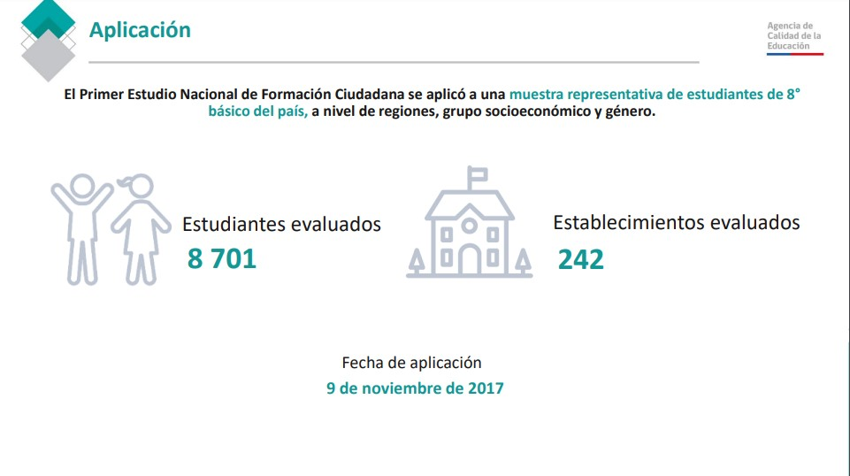
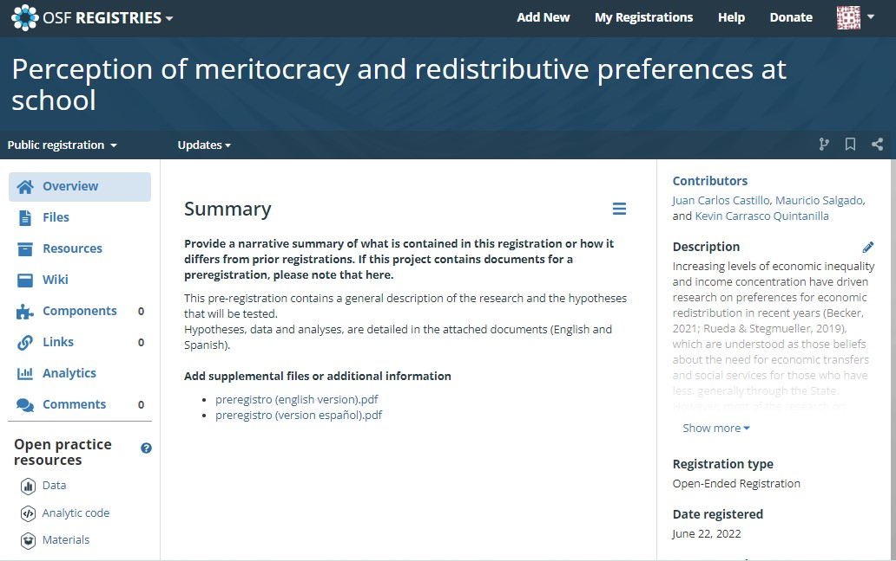
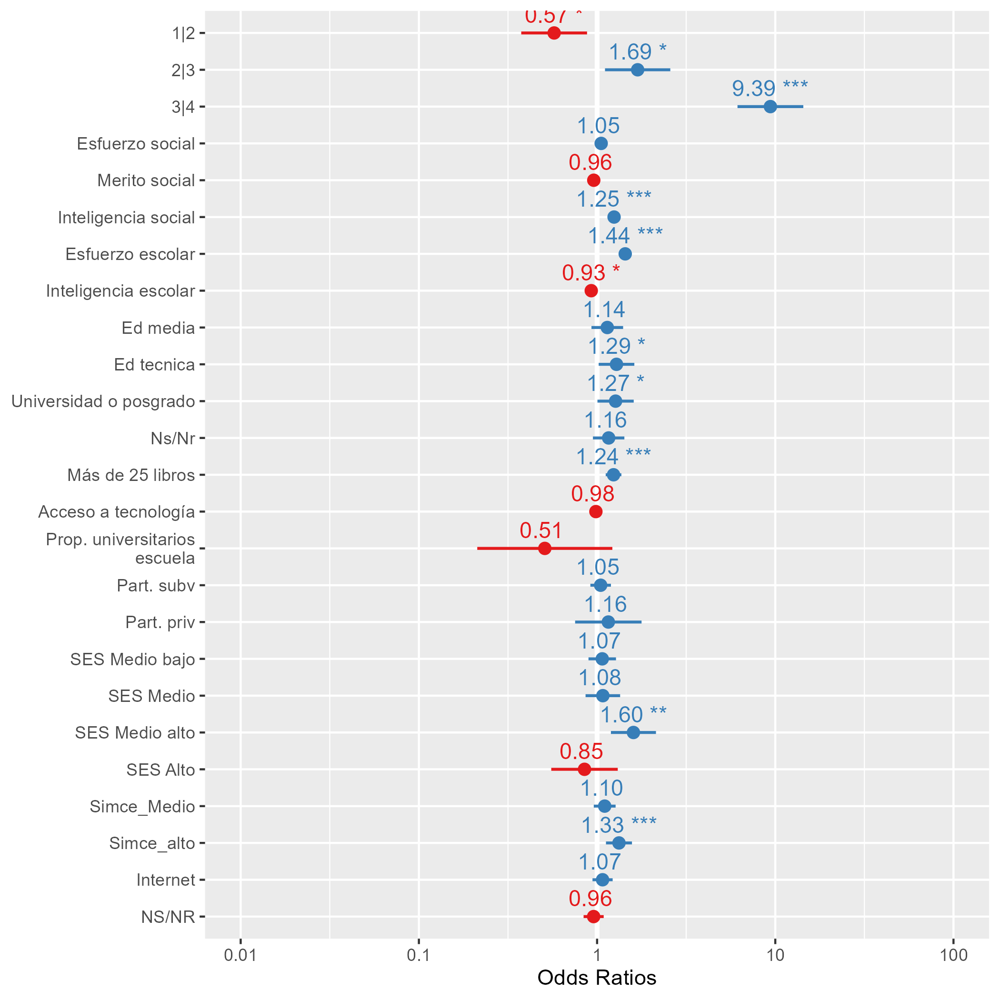

class: title-slide, middle, center

background-image: url(images/edumer.png), url(images/logocoes.png)
background-position: bottom left, bottom right
background-size: 25%, 25%
```{r xaringan-themer, include=FALSE, warning=FALSE}
library(xaringanthemer)
style_duo_accent_inverse(primary_color = "#035AA6", secondary_color = "#03A696")
```

# Meritocracia, preferencias redistributivas y socialización política escolar

### **Resultados preliminares**

Juan Carlos Castillo, Mauricio Salgado & Kevin Carrasco

**FONDECYT N°1210847 Meritocracia en la escuela**

.small[Martes 30 de agosto de 2022]

---

## Estructura de la presentación

* Primer estudio de Formación Ciudadana 2017

* Diseño de la investigación y preregistro de hipótesis

* Modelo teórico

* Primeros resultados

---

## Primer estudio nacional de Formación Ciudadana 2017

.pull-left[
* Realizado por la Agencia de Calidad de Educación

* 3 bases de datos

* Problemas de documentación
]

.pull-right[
.right[
]
]

---
## Diseño de la investigación y preregistro de hipótesis


.pull-left[
.left[
]
]
.pull-right[

* Largo proceso de planificación

* Reestructurado varias veces

* Marco general de investigación; no se especifican ciertos análisis
]

.center[https://doi.org/10.17605/OSF.IO/UFSDV]

---

## Modelo teórico

.center[]

---

# Primeros resultados

---
.center.small[Índice acceso a bienestar social]

.center[]


---
.center.small[Disminución de Brechas]

.center[]

---

class: middle, center

background-image: url(images/edumer.png), url(images/logocoes.png)
background-position: bottom left, bottom right
background-size: 25%, 25%


# Meritocracia, preferencias redistributivas y socialización política escolar

### **Resultados preliminares**

Juan Carlos Castillo, Mauricio Salgado & Kevin Carrasco

**FONDECYT N°1210847 Meritocracia en la escuela**

.small[Martes 30 de agosto de 2022]