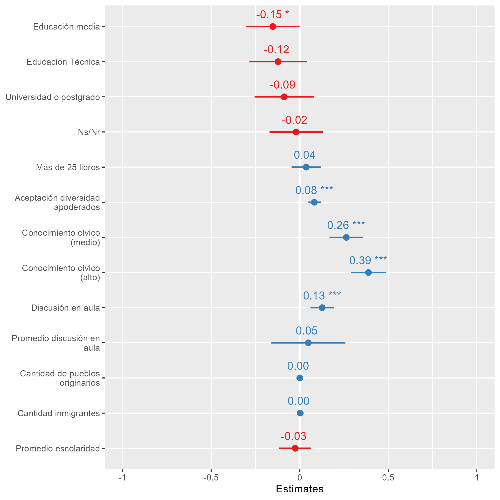
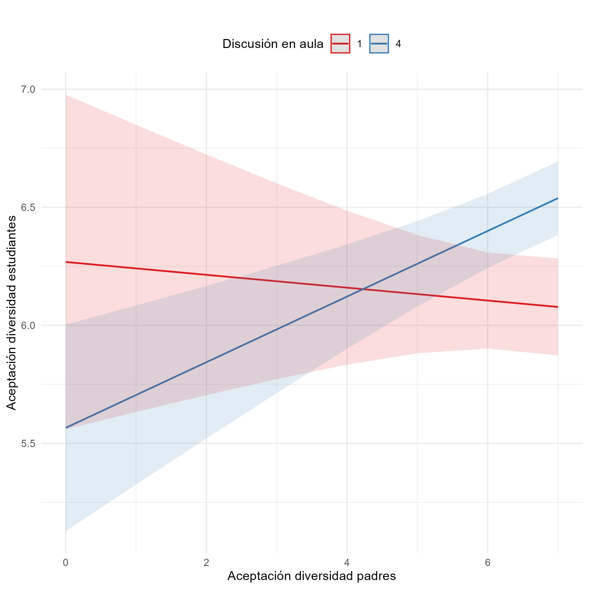

class: title-slide, middle, center

background-image: url(images/facso.png), url(images/logocoes.png)
background-position: bottom left, bottom right
background-size: 30%, 25%
```{r xaringan-themer, include=FALSE, warning=FALSE}
library(xaringanthemer)
style_duo_accent_inverse(primary_color = "#035AA6", secondary_color = "#03A696")
```

# Aceptar la diversidad en el vecindario

### **Procesos de socialización política de actitudes hacia la diversidad social en jóvenes estudiantes chilenos**

Kevin Carrasco Quintanilla

**ALAS - México 2022**

.small[15 de Agosto de 2022]


---

## Estructura de la presentación

* Educación ciudadana y Políticas educativas

* Procesos de socialización política de actitudes

* Metodología e hipótesis

* Primeros resultados

* Discusión

---

## Contexto

--

### Educación ciudadana y Políticas educativas

* <p style="text-align: justify;"> Educación ciudadana en Chile </p>

* <p style="text-align: justify;"> Nueva ley de Formación Ciudadana 2018 </p>

--

### Esta investigación

* <p style="text-align: justify;"> El incremento de la diversidad social es un desafío para los Estados-nación a nivel global </p>

* <p style="text-align: justify;"> Desafío específico para los sistemas educacionales </p>

* <p style="text-align: justify;"> Aceptar la diversidad en el vecindario. </p>

---

* Cambios en la aceptación de grupos en el vecindario en población adulta

.center[]

---

### Procesos de socialización política de actitudes

#### Socialización política familiar

* Condiciones socioeconómicas

* Actitudes de los padres

--

#### Socialización política en la escuela

* Conocimiento cívico y funcionamiento de la sociedad

* Espacios de discusión y debate en las salas de clase

--

#### Implicancias específicas de los territorios

* Cantidad de personas que se identifican con una etnia

* Cantidad de personas migrantes

* Promedio de años de escolaridad

---
## Resumen de la investigación
.center[]

---

```{r xaringan-panelset, echo=FALSE}
library(xaringanExtra)
xaringanExtra::use_panelset()
```
.panelset[
.panel[.panel-name[Estudiantes]
.center[]
]
.panel[.panel-name[Apoderados]
.center[]
]
]
---

.panelset[
.panel[.panel-name[Estudiantes]
.center[]
]
.panel[.panel-name[Apoderados]
.center[]
]
]

---
### Primeros resultados

.center[]

---
### Primeros resultados

.center[]

---
## Discusión

En general, la transmisión intergeneracional de actitudes es lo que prima dentro de la familia. Así, **las actitudes de los padres son las influyen en las actitudes de los estudiantes**. No se observan diferencias según condiciones socioeconómicas de la familia

Dentro de **la escuela**, el conocimiento cívico de los estudiantes y los espacios de discusión dentro de las aulas **influyen positivamente en la construcción de ciudadanos más tolerantes**. Aún más, en aulas donde se fomenta la discusión y debate entre estudiantes, el efecto de la transmisión intergeneracional se modifica.

Por lo tanto, se plantea como esencial para las escuelas y el sistema educativo en su conjunto **fomentar los espacios de discusión, el pluralismo de ideas y la convivencia**, para así garantizar para todos/as los estudiantes -ciudadanos futuros- la presencia de actitudes tolerantes hacia los grupos sociales que son distintos a sí mismos.

---
class: inverse

.pull-left[
# Aceptar la diversidad en el vecindario
### Kevin Carrasco Quintanilla
### FACSO uchile - COES
### ALAS - México 2022
]


.pull-right[
.right[
<br>
<br>
<br>
<br>
<br>
<br>
<br>

]
]
