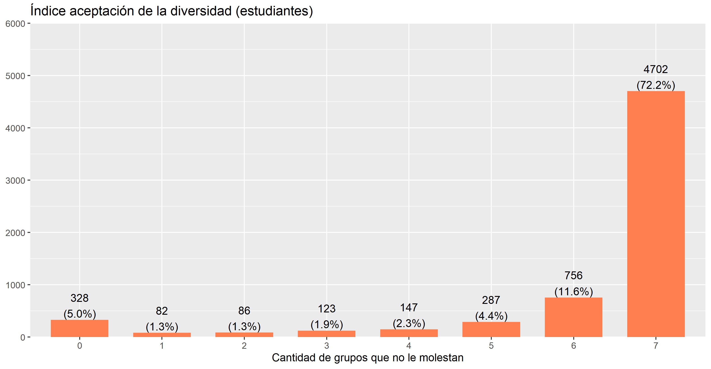

```{r xaringan-themer, include=FALSE, warning=FALSE}
library(xaringanthemer)
style_duo_accent_inverse(primary_color = "#035AA6", secondary_color = "#03A696")
```

## Estructura de la presentación

* Introducción

* Antecedentes e hipótesis

* Descriptivos

---

## Motivaciones e intereses

--

* <p style="text-align: justify;"> ¿Por qué estudiar los procesos de socialización? </p>

* <p style="text-align: justify;"> Educación para la Ciudadanía </p>

--

## Contexto

--

* <p style="text-align: justify;"> El incremento de la diversidad social es un desafío para los Estados-nación a nivel global </p>

* <p style="text-align: justify;"> Desafío específico para los sistemas educacionales </p>

* <p style="text-align: justify;"> Aceptar la diversidad en el vecindario. </p>

---

* Cambios en la aceptación de grupos en el vecindario en población adulta

.center[]

---

## Antecedentes teóricos y empíricos

.center[]

---

```{r xaringan-panelset, echo=FALSE}
library(xaringanExtra)
xaringanExtra::use_panelset()
```
.panelset[
.panel[.panel-name[Estudiantes]
.center[]
]
.panel[.panel-name[Apoderados]
.center[]
]
]
---

.panelset[
.panel[.panel-name[Estudiantes]
.center[]
]
.panel[.panel-name[Apoderados]
.center[]
]
]

---

.large[Aceptar la diversidad en el vecindario]

.medium[**Procesos de socialización política de actitudes hacia la diversidad social en jóvenes estudiantes chilenos**]

Kevin Carrasco Quintanilla

.small[**Universidad de Chile**]

.small[Jueves 6 de junio de 2022]